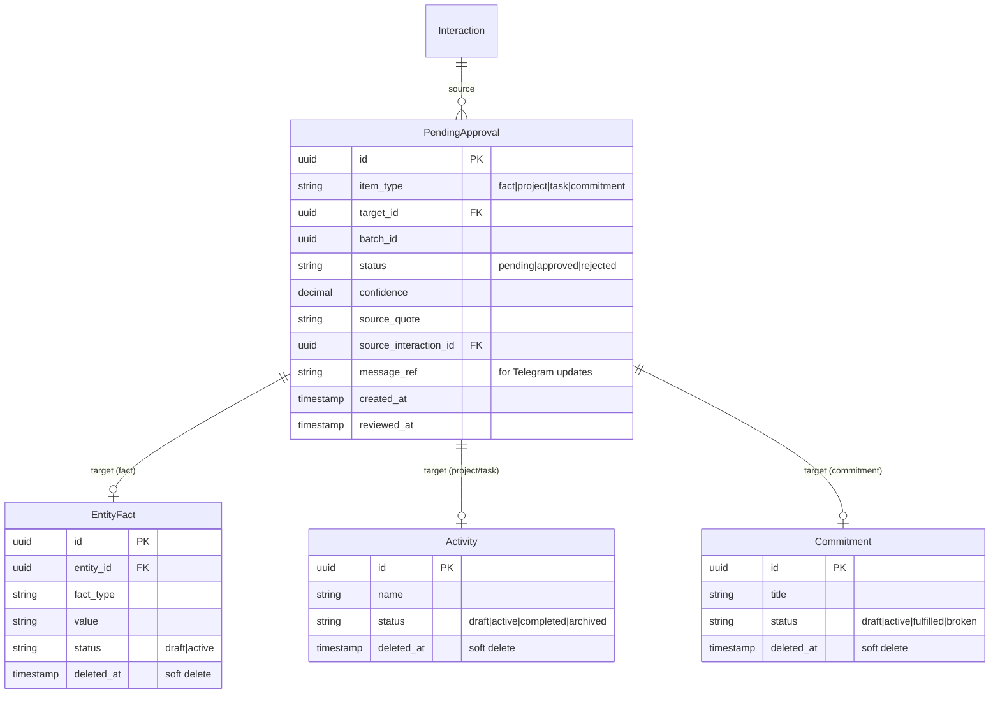

---
title: "Рефакторинг Extraction Flow: Redis Carousel → Draft Entities + PendingApproval"
type: refactor
date: 2026-01-31
revised: 2026-01-31
deepened: 2026-01-31
---

# Рефакторинг Extraction Flow: Redis Carousel → Draft Entities

## Enhancement Summary

**Deepened on:** 2026-01-31
**Research agents used:** 8 (soft-delete, draft-entity, TypeORM docs, data-integrity, performance, simplicity, NestJS patterns, codebase exploration)

### Key Improvements from Research

1. **Batch processing для cleanup job** — избежать OOM и длинных транзакций при 10K+ записей
2. **Partial indexes** — `WHERE deleted_at IS NULL` для ускорения типичных запросов
3. **Pessimistic locking** — предотвращение race conditions при concurrent approve/reject
4. **Transactional creation** — создание target + approval атомарно для избежания orphans

### Critical Discoveries

⚠️ **В кодовой базе уже 5 разных approval паттернов!**
- `PendingFact`, `PendingConfirmation`, `ExtractedEvent.status`, `PendingEntityResolution`, `Entity.deletedAt`
- Рассмотреть использование существующего `PendingConfirmation` вместо нового `PendingApproval`

### Финальные решения

| Item | Решение | Детали |
|------|---------|--------|
| Retention period | **Конфигурируемый** | `PENDING_APPROVAL_RETENTION_DAYS` в env, default 30 |
| Batch operations | **В MVP** | `approveBatch(batchId)`, `rejectBatch(batchId)` |
| Cleanup cron job | **Реализовать** | Нужен для soft delete, учитывает retention setting |
| Immediate delete | **Опционально** | Если retention = 0, hard delete без cleanup |

---

## Overview

Заменить временное хранение извлечённых данных в Redis (ExtractionCarouselStateService) на **Draft Entities** — реальные сущности в PostgreSQL со статусом `draft`, связанные с записями в таблице `pending_approvals`. Это устранит потерю данных при истечении TTL, обеспечит полноценную типизацию и позволит работать с данными через стандартные API.

## Problem Statement / Motivation

### Текущие проблемы

1. **TTL = потеря данных**: Redis carousel истекает через 1 час. Если пользователь не успел подтвердить — данные теряются безвозвратно.

2. **Дублирование логики**:
   - `ExtractionCarouselStateService` — временное хранение в Redis
   - `PendingFact` entity — уже имеет `status: pending | approved | rejected`
   - Два параллельных механизма для одной задачи

3. **Mini App не видит данные**: Dashboard возвращает пустой массив, потому что carousel живёт только в Redis и не доступен через стандартные API.

4. **JSONB blob — антипаттерн**: Хранение разных типов данных (fact, project, task, commitment) в одном JSONB поле нарушает типизацию, усложняет запросы и миграции.

### Почему Draft Entities — правильное решение

- ✅ Каждый тип данных хранится в своей таблице с правильной схемой
- ✅ Можно делать запросы по любым полям (deadline, priority, assignee)
- ✅ Полная типизация на уровне TypeScript и PostgreSQL
- ✅ `PendingApproval` — тонкая прослойка для workflow, без дублирования данных
- ✅ Soft Delete + TTL Cleanup для возможности восстановления

## Proposed Solution

### Архитектура Draft Entities + PendingApproval

```
┌─────────────────────────────────────────────────────────────────┐
│                        EXTRACTION                                │
│  /daily → Claude → creates draft entities + pending_approvals   │
└─────────────────────────────────────────────────────────────────┘
                              │
                              ▼
┌─────────────────────────────────────────────────────────────────┐
│  pending_approvals                    │  Target Entities         │
│  ─────────────────                    │  (status = 'draft')      │
│  id: pa-123                           │                          │
│  itemType: 'project'          ───────►│  activities.id: act-456  │
│  targetId: act-456                    │  activities.status: draft│
│  batchId: batch-789                   │  activities.name: 'X'    │
│  status: 'pending'                    │  (все поля типизированы) │
└─────────────────────────────────────────────────────────────────┘
                              │
              ┌───────────────┴───────────────┐
              ▼                               ▼
        ┌─────────┐                     ┌─────────┐
        │ APPROVE │                     │ REJECT  │
        └────┬────┘                     └────┬────┘
             │                               │
             ▼                               ▼
   ┌──────────────────┐           ┌──────────────────┐
   │ target.status    │           │ target.deletedAt │
   │   = 'active'     │           │   = now()        │
   │ approval.status  │           │ approval.status  │
   │   = 'approved'   │           │   = 'rejected'   │
   └──────────────────┘           └──────────────────┘
                                          │
                                          ▼
                                ┌──────────────────┐
                                │  TTL CLEANUP     │
                                │  (daily cron)    │
                                │  Hard delete     │
                                │  after 30 days   │
                                └──────────────────┘
```

### Ключевые изменения

1. **При extraction** — создаём реальные entities (EntityFact, Activity, Commitment) со `status: 'draft'` + запись в `pending_approvals`
2. **При approve** — меняем `target.status = 'active'`, `approval.status = 'approved'`
3. **При reject** — Soft Delete: `target.deletedAt = now()`, `approval.status = 'rejected'`
4. **Cleanup job** — удаляет rejected items старше 30 дней
5. **Mini App / Dashboard** — показывают pending approvals через API

## Technical Considerations

### Новая entity: PendingApproval

```typescript
@Entity('pending_approvals')
export class PendingApproval {
  @PrimaryGeneratedColumn('uuid')
  id: string;

  @Column({ name: 'item_type' })
  @Index()
  itemType: 'fact' | 'project' | 'task' | 'commitment';

  @Column({ name: 'target_id', type: 'uuid' })
  targetId: string;  // ID сущности в целевой таблице

  @Column({ name: 'batch_id', type: 'uuid' })
  @Index()
  batchId: string;  // Группировка items из одной extraction сессии

  @Column({ default: 'pending' })
  @Index()
  status: 'pending' | 'approved' | 'rejected';

  @Column({ type: 'decimal', precision: 3, scale: 2 })
  confidence: number;  // Для отображения в UI

  @Column({ name: 'source_quote', type: 'text', nullable: true })
  sourceQuote: string | null;  // Цитата из сообщения

  @Column({ name: 'source_interaction_id', type: 'uuid', nullable: true })
  @Index()
  sourceInteractionId: string | null;

  @CreateDateColumn({ name: 'created_at' })
  createdAt: Date;

  @Column({ name: 'reviewed_at', type: 'timestamp with time zone', nullable: true })
  reviewedAt: Date | null;
}
```

### Изменения в существующих entities

Добавить `status` и `deletedAt` для soft delete:

```typescript
// entity-fact.entity.ts
@Column({ default: 'active' })
status: 'draft' | 'active';

@Column({ name: 'deleted_at', type: 'timestamp with time zone', nullable: true })
@Index()
deletedAt: Date | null;

// activity.entity.ts (когда будет создан)
@Column({ default: 'active' })
status: 'draft' | 'active' | 'completed' | 'archived';

@Column({ name: 'deleted_at', type: 'timestamp with time zone', nullable: true })
deletedAt: Date | null;
```

### Навигация: Stateless Backend

Клиент (Telegram / Mini App) управляет навигацией локально:

```typescript
// Backend возвращает отсортированный список
GET /api/v1/pending-approvals?batchId=xxx&status=pending
→ [{ id, itemType, targetId, confidence, ... }]

// Клиент хранит currentIndex локально
// При confirm/reject передаёт ID конкретного item
```

### Workflow: Approve / Reject

```typescript
@Injectable()
export class PendingApprovalService {

  async approve(id: string): Promise<void> {
    return this.dataSource.transaction(async (manager) => {
      const approval = await manager.findOneOrFail(PendingApproval, { where: { id } });

      // Активируем target entity
      await this.activateTarget(manager, approval.itemType, approval.targetId);

      // Обновляем approval
      approval.status = 'approved';
      approval.reviewedAt = new Date();
      await manager.save(approval);
    });
  }

  async reject(id: string): Promise<void> {
    return this.dataSource.transaction(async (manager) => {
      const approval = await manager.findOneOrFail(PendingApproval, { where: { id } });

      // Soft delete target entity
      await this.softDeleteTarget(manager, approval.itemType, approval.targetId);

      // Обновляем approval
      approval.status = 'rejected';
      approval.reviewedAt = new Date();
      await manager.save(approval);
    });
  }

  private async activateTarget(manager: EntityManager, itemType: string, targetId: string): Promise<void> {
    const repo = this.getTargetRepo(manager, itemType);
    await repo.update(targetId, { status: 'active' });
  }

  private async softDeleteTarget(manager: EntityManager, itemType: string, targetId: string): Promise<void> {
    const repo = this.getTargetRepo(manager, itemType);
    await repo.update(targetId, { deletedAt: new Date() });
  }
}
```

### Batch операции

```typescript
async approveBatch(batchId: string): Promise<number> {
  return this.dataSource.transaction(async (manager) => {
    const approvals = await manager.find(PendingApproval, {
      where: { batchId, status: 'pending' }
    });

    for (const approval of approvals) {
      await this.activateTarget(manager, approval.itemType, approval.targetId);
      approval.status = 'approved';
      approval.reviewedAt = new Date();
    }

    await manager.save(approvals);
    return approvals.length;
  });
}

async rejectBatch(batchId: string): Promise<number> {
  return this.dataSource.transaction(async (manager) => {
    const approvals = await manager.find(PendingApproval, {
      where: { batchId, status: 'pending' }
    });

    for (const approval of approvals) {
      await this.softDeleteTarget(manager, approval.itemType, approval.targetId);
      approval.status = 'rejected';
      approval.reviewedAt = new Date();
    }

    await manager.save(approvals);
    return approvals.length;
  });
}
```

### TTL Cleanup Job

```typescript
@Injectable()
export class PendingApprovalCleanupService {
  private readonly logger = new Logger(PendingApprovalCleanupService.name);
  private readonly RETENTION_DAYS = 30;

  @Cron('0 3 * * *')  // Каждый день в 3:00
  async cleanupRejectedItems(): Promise<void> {
    const cutoff = subDays(new Date(), this.RETENTION_DAYS);

    await this.dataSource.transaction(async (manager) => {
      // Находим старые rejected approvals
      const oldRejected = await manager.find(PendingApproval, {
        where: {
          status: 'rejected',
          reviewedAt: LessThan(cutoff),
        },
      });

      this.logger.log(`Cleaning up ${oldRejected.length} rejected items older than ${this.RETENTION_DAYS} days`);

      // Hard delete target entities
      for (const approval of oldRejected) {
        await this.hardDeleteTarget(manager, approval.itemType, approval.targetId);
      }

      // Удаляем approval записи
      await manager.delete(PendingApproval, {
        status: 'rejected',
        reviewedAt: LessThan(cutoff),
      });
    });
  }

  // Backup: удаляем orphaned drafts (на случай crashes)
  @Cron('0 4 * * *')
  async cleanupOrphanedDrafts(): Promise<void> {
    const cutoff = subDays(new Date(), 1);  // Drafts старше 24 часов без approval

    // EntityFacts
    const orphanedFacts = await this.dataSource.query(`
      DELETE FROM entity_facts ef
      WHERE ef.status = 'draft'
        AND ef.created_at < $1
        AND NOT EXISTS (
          SELECT 1 FROM pending_approvals pa
          WHERE pa.target_id = ef.id
            AND pa.item_type = 'fact'
            AND pa.status = 'pending'
        )
      RETURNING ef.id
    `, [cutoff]);

    if (orphanedFacts.length > 0) {
      this.logger.warn(`Cleaned up ${orphanedFacts.length} orphaned draft facts`);
    }

    // Аналогично для Activity, Commitment...
  }
}
```

### API Design (RESTful)

```typescript
// Список pending items
GET /api/v1/pending-approvals
GET /api/v1/pending-approvals?batchId=xxx
GET /api/v1/pending-approvals?status=pending

// Детали с target entity
GET /api/v1/pending-approvals/:id

// Одиночные операции
PATCH /api/v1/pending-approvals/:id
Body: { status: 'approved' } или { status: 'rejected' }

// Batch операции
POST /api/v1/pending-approvals/batch/:batchId/approve
POST /api/v1/pending-approvals/batch/:batchId/reject
```

### Миграция existing code

1. `ExtractionCarouselStateService` → deprecated, затем удалить
2. `DailySummaryHandler.handleExtractCallback` → создаёт draft entities + PendingApproval
3. `ExtractionPersistenceService` → заменить на PendingApprovalService
4. `TelegramMiniAppController.getExtraction` → читать из pending_approvals + join с targets
5. Существующий `PendingFact` entity → оставить для backward compatibility, постепенно мигрировать

## Acceptance Criteria

### Functional Requirements

- [x] Extraction из /daily создаёт draft entities + PendingApproval записи
- [x] Mini App показывает pending approvals на dashboard
- [x] Approve активирует target entity (`status: draft → active`)
- [x] Reject делает soft delete (`deletedAt = now()`)
- [x] Pending items НЕ теряются после перезагрузки/timeout
- [x] Batch approve/reject работает для всех items в batch
- [x] Rejected items можно восстановить в течение 30 дней
- [x] Cleanup job удаляет rejected items старше 30 дней

### Non-Functional Requirements

- [x] Производительность: pending_approvals индексированы по status, batchId, sourceInteractionId
- [x] Производительность: target entities имеют индекс на deletedAt для soft delete
- [x] Тесты: unit + integration для approve/reject/batch flows
- [x] Тесты: cleanup job корректно удаляет orphaned drafts

### Quality Gates

- [x] Все existing extraction tests проходят
- [x] E2E: /daily → confirm all → verify draft entities activated
- [x] E2E: /daily → reject all → verify soft delete + cleanup after 30 days
- [ ] No Redis dependency для extraction flow (partial — old `exc_*` callbacks still use Redis)

## Dependencies & Prerequisites

- [ ] Activity entity (из Phase D: Jarvis Foundation) — для projects/tasks
- [ ] Commitment entity — проверить наличие, добавить status/deletedAt
- [ ] EntityFact — добавить status/deletedAt поля
- [ ] Mini App frontend готов к изменению API

**Поэтапный подход:** Начать с facts only, добавить projects/tasks/commitments когда entities будут готовы.

## Risk Analysis & Mitigation

| Risk | Impact | Mitigation |
|------|--------|------------|
| Activity entity ещё не существует | Medium | Начать с facts, расширить позже |
| Orphaned drafts при crashes | Low | Backup cleanup job каждые 24 часа |
| Telegram UX зависит от messageRef | Medium | Сохранять messageRef в отдельном поле PendingApproval |
| Большое количество pending items | Low | Pagination, индексы, 30-day cleanup |
| Восстановление после reject | Low | Soft delete сохраняет данные 30 дней |

## Implementation Phases

### Phase 1: Infrastructure (2-3 дня) ✅

**Цель:** Создать PendingApproval entity и подготовить target entities

- [x] Создать `PendingApproval` entity
- [x] Добавить `status: 'draft' | 'active'` и `deletedAt` в EntityFact
- [x] Создать миграции
- [x] Создать `PendingApprovalService` с базовыми методами (create, approve, reject)
- [x] Добавить batch методы (approveBatch, rejectBatch)
- [x] Unit tests для service

**Файлы:**
```
packages/entities/src/pending-approval.entity.ts (new)
packages/entities/src/entity-fact.entity.ts (modify)
apps/pkg-core/src/modules/pending-approval/pending-approval.module.ts (new)
apps/pkg-core/src/modules/pending-approval/pending-approval.service.ts (new)
apps/pkg-core/src/database/migrations/XXXX-create-pending-approvals.ts (new)
apps/pkg-core/src/database/migrations/XXXX-add-status-to-entity-facts.ts (new)
```

### Phase 2: Extraction Flow (2-3 дня) ✅

**Цель:** Переключить extraction на создание draft entities

- [x] Модифицировать SecondBrainExtractionService для создания drafts + approvals
- [x] Обновить DailySummaryHandler для работы с PendingApprovalService
- [x] Сохранять messageRef для обновления Telegram сообщений
- [x] Deprecate ExtractionCarouselStateService (оставить для обратной совместимости)
- [x] Integration tests (draft-extraction.e2e-spec.ts)

**Файлы:**
```
apps/pkg-core/src/modules/extraction/second-brain-extraction.service.ts
apps/telegram-adapter/src/bot/handlers/daily-summary.handler.ts
apps/pkg-core/src/modules/extraction/extraction-carousel-state.service.ts (deprecated)
```

### Phase 3: API & Mini App (2-3 дня) ✅

**Цель:** REST API + Mini App integration

- [x] REST endpoints: GET /pending-approvals, PATCH /:id, POST /batch/:batchId/approve|reject
- [x] Обновить dashboard endpoint для показа pending approvals
- [x] Frontend: обновить список pending items (PendingApprovalList.vue)
- [x] Frontend: роутинг approval actions на pending-approval страницу
- [x] E2E tests (pending-approval.e2e-spec.ts)

**Файлы:**
```
apps/pkg-core/src/modules/pending-approval/pending-approval.controller.ts (new)
apps/pkg-core/src/modules/telegram-mini-app/controllers/telegram-mini-app.controller.ts
apps/mini-app/src/api/client.ts
apps/mini-app/src/views/DashboardView.vue
apps/mini-app/src/components/PendingApprovalList.vue (new)
```

### Phase 4: Cleanup & Polish (1-2 дня) ✅

**Цель:** TTL cleanup + удаление старого кода

- [x] Создать PendingApprovalCleanupService с cron jobs
- [x] ExtractionCarouselStateService: deprecated (не удалён для backward compat с `exc_*` callbacks)
- [ ] Удалить Redis keys для extraction (отложено — требует полной миграции callback flow)
- [x] Документация (план обновлён, TypeORM closure-table bug задокументирован)
- [ ] Мониторинг: алерты на orphaned drafts (post-MVP)

**Файлы:**
```
apps/pkg-core/src/modules/pending-approval/pending-approval-cleanup.service.ts (new)
apps/pkg-core/src/modules/extraction/extraction-carousel-state.service.ts (delete)
docs/ARCHITECTURE.md (update)
```

## ERD Changes



## References

### Internal References
- Existing carousel implementation: `apps/pkg-core/src/modules/extraction/extraction-carousel-state.service.ts`
- PendingFact entity (legacy): `packages/entities/src/pending-fact.entity.ts`
- Daily handler: `apps/telegram-adapter/src/bot/handlers/daily-summary.handler.ts`

### Related Plans
- Context-Aware Extraction: `docs/plans/2025-01-25-conversation-based-extraction-design.md`
- Phase D Jarvis Foundation: `docs/second-brain/05-JARVIS-FOUNDATION.md`

### Review Feedback Incorporated
- ❌ JSONB metadata blob → ✅ Draft entities с полной типизацией
- ❌ Polymorphic PendingFact → ✅ Тонкий PendingApproval + typed target entities
- ❌ Immediate delete → ✅ Soft Delete + 30-day TTL cleanup
- ✅ Bulk operations сохранены (approveBatch, rejectBatch)
- ✅ Stateless navigation (клиент управляет позицией)

---

## Research Insights (from /deepen-plan)

### Существующие паттерны в кодовой базе

**КРИТИЧНО:** В PKG уже существует 5 разных паттернов approval workflow:

| Entity | Status Field | Паттерн |
|--------|--------------|---------|
| `PendingFact` | `pending/approved/rejected` | Отдельная таблица |
| `PendingConfirmation` | `pending/confirmed/declined/expired` | Полиморфный generic |
| `ExtractedEvent` | `pending/confirmed/rejected/expired/auto_processed` | Inline status |
| `PendingEntityResolution` | `pending/resolved/ignored` | Отдельная таблица |
| `Entity` | `@DeleteDateColumn` | Soft delete |

**Рекомендация:** Использовать существующий `PendingConfirmation` или inline status вместо создания 6-го паттерна.

### TypeORM Soft Delete Best Practices

**@DeleteDateColumn:**
```typescript
@DeleteDateColumn({ name: 'deleted_at', type: 'timestamptz' })
@Index('idx_entity_facts_deleted_at')
deletedAt: Date | null;
```

**Partial Index для производительности:**
```sql
CREATE INDEX idx_entity_facts_active
  ON entity_facts(entity_id, fact_type)
  WHERE deleted_at IS NULL;
```

**Cascade soft delete НЕ поддерживается TypeORM** — нужна ручная реализация.

### Performance Recommendations for Cleanup Job

**Проблемы текущего дизайна:**
- Загрузка всех записей в память (OOM при 10K+ записей)
- N+1 DELETE внутри транзакции
- Длинные транзакции блокируют таблицу

**Оптимизированный подход:**
```typescript
@Cron('0 3 * * *')
async cleanupRejectedItems(): Promise<void> {
  const BATCH_SIZE = 500;
  let totalDeleted = 0;

  while (true) {
    const deleted = await this.dataSource.transaction(async (manager) => {
      const batch = await manager
        .createQueryBuilder(PendingApproval, 'pa')
        .select(['pa.id', 'pa.itemType', 'pa.targetId'])
        .where('pa.status = :status', { status: 'rejected' })
        .andWhere('pa.reviewedAt < :cutoff', { cutoff })
        .limit(BATCH_SIZE)
        .getMany();

      if (batch.length === 0) return 0;

      // Bulk delete by type
      const groupedByType = this.groupByItemType(batch);
      for (const [itemType, items] of Object.entries(groupedByType)) {
        const targetIds = items.map(i => i.targetId);
        await manager.delete(entityMap[itemType], { id: In(targetIds) });
      }

      // Delete approvals
      await manager.delete(PendingApproval, { id: In(batch.map(b => b.id)) });
      return batch.length;
    });

    if (deleted === 0) break;
    totalDeleted += deleted;
    await this.delay(100); // Allow other queries
  }
}
```

### Data Integrity Recommendations

**Polymorphic target_id риски:**
- Нет FK constraint → orphaned approvals возможны
- Нет валидации target exists

**Решение A: Trigger-based validation:**
```sql
CREATE TRIGGER trg_validate_pending_approval_target
  BEFORE INSERT OR UPDATE ON pending_approvals
  FOR EACH ROW EXECUTE FUNCTION validate_pending_approval_target();
```

**Решение B: Transactional creation:**
```typescript
async createDraftWithApproval<T>(
  itemType: string,
  entityData: Partial<T>,
): Promise<{ target: T; approval: PendingApproval }> {
  return this.dataSource.transaction(async (manager) => {
    // Create target first
    const target = await manager.save(entityClass, { ...entityData, status: 'draft' });
    // Then approval
    const approval = await manager.save(PendingApproval, { itemType, targetId: target.id });
    return { target, approval };
  });
}
```

### Service Layer Improvements

**Добавить в PendingApprovalService:**

1. **Pessimistic locking** для concurrent safety:
```typescript
const approval = await manager.findOne(PendingApproval, {
  where: { id },
  lock: { mode: 'pessimistic_write' },
});
```

2. **Idempotency check:**
```typescript
if (approval.status !== 'pending') {
  throw new ConflictException(`Already ${approval.status}`);
}
```

3. **Verify target exists:**
```typescript
const result = await repo.update(targetId, { status: 'active' });
if (result.affected === 0) {
  throw new NotFoundException(`Target ${itemType} ${targetId} not found`);
}
```

4. **Logging:**
```typescript
private readonly logger = new Logger(PendingApprovalService.name);
this.logger.log(`Approved ${itemType} target=${targetId}`);
```

### YAGNI Simplifications to Consider

| Item | Verdict | Reason |
|------|---------|--------|
| 30-day retention | **Consider removing** | No user story requires viewing rejected 30 days later |
| Cleanup job | **Remove if no retention** | Adds cron dependency, failure modes |
| Batch operations | **Defer to post-MVP** | Single-item sufficient for 5-10 pending items |
| New PendingApproval entity | **Use existing patterns** | ExtractedEvent.status already works |

### Migration Safety Checklist

- [ ] Add `status` column with `DEFAULT 'active'` (safe for existing data)
- [ ] Create indexes with `CONCURRENTLY` to avoid table locks
- [ ] Update ALL queries in EntityFactService to filter by `status = 'active'`
- [ ] Add partial index `WHERE deleted_at IS NULL` for performance
- [ ] Test rollback on staging before production

### Sources

- [TypeORM Soft Delete Documentation](https://typeorm.io/delete-query-builder#soft-delete)
- [PostgreSQL Partial Indexes](https://www.postgresql.org/docs/current/indexes-partial.html)
- [NestJS Schedule Module](https://docs.nestjs.com/techniques/task-scheduling)
- [REST API Workflow Patterns](https://kennethlange.com/how-to-model-workflows-in-rest-apis/)
- [Azure Batch API Design](https://learn.microsoft.com/en-us/azure/architecture/best-practices/api-design)
